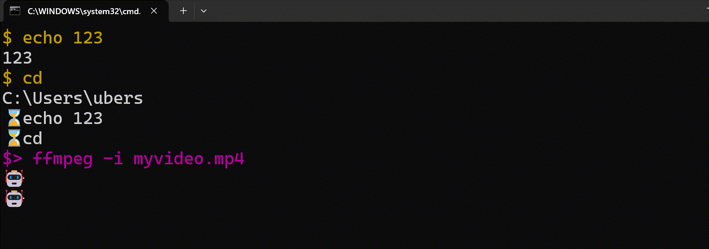

# Caroushell

[](https://www.npmjs.com/package/caroushell)
[](https://www.npmjs.com/package/caroushell)

Caroushell is an interactive terminal carousel that suggests commands from your
history, and AI suggestions as you type.

## Features

- The top panel of the carousel shows history.
- The bottom panel of the carousel shows AI-generated command suggestions.
- Go up and down the carousel with arrow keys.
- Press `Enter` to run the highlighted command.
- Logs activity under `~/.caroushell/logs` for easy troubleshooting.
- Extensible config file (`~/.caroushell/config.toml`) so you can point the CLI
  at different AI providers.

## UI

The UI layout looks like this:

```
⌛history2
⌛history1
$> YOU TYPE YOUR SHELL commands HERE
🤖ai suggestion1
🤖ai suggestion2
```

Here's an example using a comment to get AI autocompletion for ffmpeg:

```
⌛echo 123
⌛cd
$> ffmpeg -i myvideo.mp4 # slowmo 50%
🤖ffmpeg -i myvideo.mp4 -filter:v "setpts=2.0*PTS" output_slow.mp4
🤖ffmpeg -i myvideo.mp4 -vf "setpts=0.5*PTS" output_fast.mp4
```

It would look like this:



## Requirements

- Node.js 18 or newer.
- On first launch Caroushell will prompt you for an OpenAI-compatible endpoint
  URL, API key, and model name, then store them in `~/.caroushell/config.toml`.
- You can also create the file manually:

```toml
apiUrl = "https://openrouter.ai/api/v1"
apiKey = "your-api-key"
model = "gpt-4o-mini"
```

or

```toml
GEMINI_API_KEY = "AIzaSyD...N-wK"
```

Any endpoint that implements the OpenAI Chat Completions API (OpenRouter,
OpenAI, etc.) will work as long as the URL, key, and model are valid. If you
only provide a Gemini API key in the config, Caroushell will default to the
Gemini Flash Lite 2.5 endpoint and model.

## Installation

Install globally (recommended):

```bash
npm install -g caroushell
caroushell
```

Or run it with NPX:

```bash
npx caroushell
```

## Usage

Caroushell opens an interactive prompt:

- Type to update the suggestions immediately and trigger refreshed history/AI
  results.
- Use arrow keys to move between suggestions in the carousel.
- Press `Enter` to run the highlighted command.
- Press `Ctrl+C` to exit. `Ctrl+D` exits when the current row is empty.
- Press `Tab` to autocomplete a file suggestion or browse files and folders
  with the arrow keys.

Logs are written to `~/.caroushell/logs/MM-DD.txt`. Inspect these files if you
need to debug AI suggestions or the terminal renderer. Configuration lives at
`~/.caroushell/config.toml` (override via `CAROUSHELL_CONFIG_PATH`).

## Development

```bash
npm install            # install dependencies
npm run dev            # run the shell
npm run test:generate  # tests ai text generation
npm publish --dry-run  # verify package contents before publishing
```

The `prepare` script automatically builds before `npm publish` or when
installing from git. The package ships only the compiled `dist/` output plus
this README and the MIT license so `npx caroushell` works immediately.

## License

Released under the [MIT License](./LICENSE).
