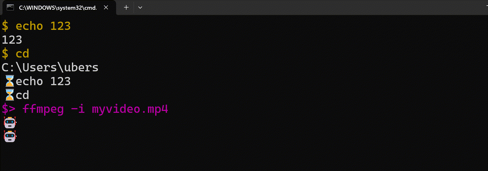

# Caroushell

[](https://www.npmjs.com/package/caroushell)
[](https://www.npmjs.com/package/caroushell)

Caroushell makes the terminal a little more fun: see your command history as you
type and hop between folders with the arrow keys. Pick a command or folder,
press `Enter`, and keep moving.

If you want, you can get AI command suggestions too.

## Try it out

With Node.js 18 or newer installed, run:

```bash
npm install -g caroushell
caroushell
```

Or give it a spin with NPX:

```bash
npx caroushell
```

On first launch, answer `n` when asked about AI auto-complete to jump straight
into history and folder navigation. No API key required. You can always
[set up AI suggestions later](#setup).

## Features

- See matching commands from your history above the prompt as you type.
- Browse matching folders below the prompt and jump into them with `Enter`.
- Go up and down the carousel with arrow keys.
- Press `Enter` to run the highlighted command.
- Optionally connect an AI provider for command suggestions.

## UI

Without AI, history appears above the prompt and folders appear below it. For
example, typing `pro` might look like this:

```
⌛git checkout prototype
⌛npm run build -- --profile
$> pro
📁projects
📁prototypes
```

Arrow up to reuse a command, or arrow down to highlight `projects` and press
`Enter` to move into that folder. Type part of a folder name to narrow the list,
or a path like `src/ut` to find folders inside `src`.

With optional AI suggestions enabled, you can also use a comment to ask for
ffmpeg autocompletion:

```
⌛echo 123
⌛cd
$> ffmpeg -i myvideo.mp4 # slowmo 50%
🤖ffmpeg -i myvideo.mp4 -filter:v "setpts=2.0*PTS" output_slow.mp4
🤖ffmpeg -i myvideo.mp4 -vf "setpts=0.5*PTS" output_fast.mp4
```

It would look like this:



## Setup

- Node.js 18 or newer.
- On first launch, Caroushell helps you choose a prompt and asks whether you
  want AI auto-complete. Choose `n` to use history and folder navigation without
  AI.
- If you choose AI, it prompts for an OpenAI-compatible endpoint URL, API key,
  and model name, then stores them in `~/.caroushell/config.toml`.
- Logs are at `~/.caroushell/logs` for easy troubleshooting.

To enable AI later, add your provider settings to `~/.caroushell/config.toml`:

```toml
apiUrl = "https://openrouter.ai/api/v1"
apiKey = "your-api-key"
model = "gpt-4o-mini"
```

or

```toml
GEMINI_API_KEY = "AIzaSyD...N-wK"
```

Any endpoint that implements the OpenAI Chat Completions API (OpenRouter,
OpenAI, etc.) will work as long as the URL, key, and model are valid. If you
only provide a Gemini API key in the config, Caroushell will default to the
Gemini Flash Lite 2.5 endpoint and model.

## Prompt Display

Caroushell can render a custom prompt using a template string in
`~/.caroushell/config.toml`:

```toml
prompt = "{hostname} {short-directory} $>"
```

Available tokens:

- `{hostname}`
- `{directory}`
- `{short-directory}`

Examples:

```toml
prompt = "$> "
```

```toml
prompt = "{directory} $> "
```

```toml
prompt = "{hostname} {short-directory} $>"
```

`{short-directory}` keeps the final directory name and shortens parent
directories to their first letter. For example, `/home/user/projects/my-app`
becomes `/h/u/p/my-app`.

## Usage

Caroushell opens an interactive prompt:

- Type to update matching history and folders, or AI suggestions if enabled.
- Use arrow keys to move between suggestions in the carousel.
- Press `Enter` to run the highlighted command.
- Press `Ctrl+C` to exit. `Ctrl+D` exits when the current row is empty.
- Press `Alt+M` (`Option+M` on macOS), or type `.menu` and press Enter, to open the Caroushell menu.
  Choose a top or bottom panel source (History, Files, Folders, AI, or Off) with
  Up/Down and Enter. Esc goes back or closes the menu. Panel choices last for
  the current session.
- The Folders panel lists directories you can `cd` into, filtered by what you
  type (`src/ut` looks inside `src`). Highlight one and press Enter to `cd` into
  it; `..` goes up. Without AI configured, Folders is the default bottom panel.
- Press `Tab` to autocomplete a file suggestion or browse files and folders with
  the arrow keys. Enter accepts a file match; Esc restores your selected panel
  layout.

Logs are written to `~/.caroushell/logs/MM-DD.txt`. Inspect these files if you
need to debug AI suggestions or the terminal renderer. Configuration lives at
`~/.caroushell/config.toml` (override via `CAROUSHELL_CONFIG_PATH`).

## Development

```bash
npm install            # install dependencies
npm run dev            # run the shell
npm run test:generate  # tests ai text generation
npm publish --dry-run  # verify package contents before publishing
```

The `prepare` script automatically builds before `npm publish` or when
installing from git. The package ships only the compiled `dist/` output plus
this README and the MIT license so `npx caroushell` works immediately.

## License

Released under the [MIT License](./LICENSE).
